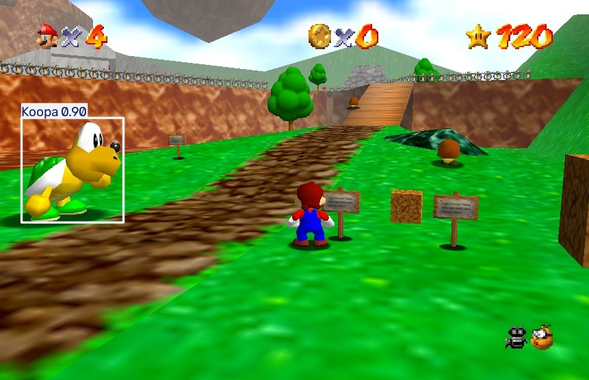

# Detección de Enemigos en Super Mario 64 utilizando YOLOv11

## Descripción del proyecto
Este proyecto corresponde al trabajo final del curso **Taller de Introducción a Visión por Computadora**. El objetivo principal es la implementación de un modelo de Deep Learning basado en **YOLOv11** orientado a la detección y clasificación de enemigos dentro del entorno tridimensional del videojuego Super Mario 64.

El sistema enfrenta desafíos clásicos de visión artificial como la baja resolución de polígonos (característica de la consola N64), variaciones de iluminación en distintos niveles y fondos complejos que comparten paleta de colores con los enemigos.

## Tecnologías Utilizadas
* **Python 3.10**
* **YOLOv11 (Ultralytics)**: Versión Nano (YOLOv11n) para optimización de inferencia.
* **PyTorch & OpenCV**: Con soporte CUDA para aceleración por GPU.
* **Roboflow**: Utilizado para la gestión del dataset, etiquetado y aplicación de técnicas de *Data Augmentation*.
* **Hardware**: Entrenamiento local realizado en **ASUS Vivobook 16** con GPU **NVIDIA RTX 4050**.

## Enemigos Detectados
El modelo fue entrenado para reconocer y diferenciar las siguientes entidades:
* **Boos**: Fantasmas con desafíos de transparencia.
* **Goomba**: Enemigos básicos con texturas similares al suelo.
* **Koopa**: Tortugas con colores vibrantes y alta tasa de detección.

## Estructura del Repositorio
```text
Vision_SM64_Yolo/
│
├── models/
│   └── best.pt             # Modelo final entrenado
│  
│
├── scripts/
│   ├── entrenar.py         # Script de entrenamiento local
│   ├── predecir.py         # Inferencia en imágenes y videos
│   └── test.py             # Verificación de entorno y CUDA
│
├── demo_results/
│   └── *.jpg / *.webm      # Evidencias de detección (Bounding Boxes)
│
├── requirements.txt        # Librerías y dependencias
├── README.md               # Documentación del proyecto
└── .gitignore              # Archivos excluidos (entornos y datasets pesados)

# Instalación

## Prerrequisitos

- Python 3.10 o superior
- CUDA (opcional para entrenamiento mediante GPU)


```
## Configuración del entorno
```
git clone https://github.com/urzua847/Vision_SM64_Yolo.git
cd Vision_SM64_Yolo

```
Crear y activar un entorno virtual:
```
# Windows
python -m venv entorno
entorno\Scripts\activate
```
```
# Linux (Ubuntu) / Mac

```
python3 -m venv entorno_linux
source entorno_linux/bin/activate

```

Instalar las dependencias:

```bash
pip install -r requirements.txt
```

---

# Modo de Uso

## Entrenar el modelo

Ejecuta el proceso de entrenamiento utilizando el dataset configurado y genera el modelo entrenado.

```bash
python scripts/entrenar.py
```

## Realizar predicciones

Permite ejecutar el modelo entrenado sobre imágenes o videos para detectar automáticamente los enemigos.

```bash
python scripts/predecir.py
```

## Verificar el entorno de ejecución

Este script permite comprobar si PyTorch detecta correctamente el dispositivo disponible para el entrenamiento (CPU o GPU).

```bash
python scripts/test.py
```

# Resultados y Métricas

## Métricas del Modelo

- Precision: **98.96 %**
- Recall: **98.96 %**
- F1-Score: **98.96 %**
- mAP@0.5: **98.97 %**
- mAP@0.5:0.95: **78.80 %**

## Rendimiento por Clase

| Clase | Precision | Recall | mAP@0.5 |
|--------|----------:|--------:|---------:|
| Boo | 99.9 % | 98.6 % | 98.5 % |
| Goomba | 99.7 % | 100 % | 98.9 % |
| Koopa | 100 % | 98.96 % | 99.5 % |

---

# Dataset

## Características del Dataset

- Total de imágenes: **1334**
- Total de anotaciones: **1988**
- Promedio de anotaciones por imagen: **1.5**
- Número de clases: **3**
- Imágenes sin anotaciones: **0**
- Resolución promedio: **0.73 MP**
- Resolución mediana: **1061 × 665**

## Fuentes de Datos

- Capturas de pantalla obtenidas desde Super Mario 64.
- Imágenes etiquetadas manualmente mediante Roboflow.

## Preprocesamiento

- Etiquetado manual mediante bounding boxes.
- División del dataset en entrenamiento, validación y prueba.
- Redimensionamiento de imágenes para el entrenamiento del modelo.

---

# Ejemplo de Inferencia

A continuación se presenta un ejemplo del funcionamiento del modelo sobre una imagen del videojuego.



---

# Autores
- Javier Villena
- Carlos Urzua

